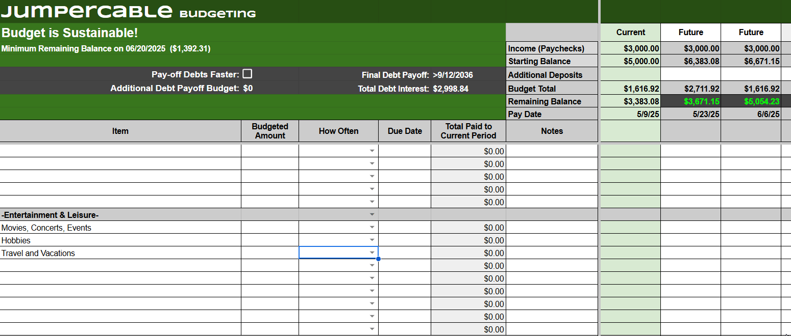

# JumperCable Budgeting Google Sheets Template

Take control of your finances with this all-in-one Google Sheet. Easily balance your budget, create a clear debt payoff plan, and forecast your financial future years into the future.

This tool helps you:
- Track income, bills, and spending by category
- Model loan payments with interest and due dates
- Plan to pay off debts faster
- Forecast your account balance over time
- Catch budget shortfalls before they happen
- Perfect for anyone looking to stay organized, avoid surprises, and build long-term financial stability.			

This tool also can analyze your debts and create a plan for you to pay them off faster.  Similar to the "Snowball" method, but instead the APR, Minimum Payment amounts, and Balances are used to sort your debts by the quickest to pay off first.  You can compare different debt payoff plans by comparing the total interest paid over time.

You can copy the worksheets from here:

https://docs.google.com/spreadsheets/d/1DbFxyxbfzLJgj56bVHbFC8SqkV-QkrKTa84A1mR77WI/copy?usp=sharing

## 💸 Support This Project

# 1) Initial Setup
In the "Instructions & Setup" worksheet, Fill in the gray boxes

Note you can pick any start date you want; however, it is typical to set this to the same day your primary paycheck typically is paid out.

# 2) Debt Setup
In the "Debts" worksheet, Enter the details of the debts 

## Do not modify the "ID" or "Number of Payments" columns

# 3) Create Your Budget Plan
In the "Budget" worksheet, Enter the details of each budgeted item

When entering income items, be sure to use a negative dollar value

## If you insert rows into the worksheet, be sure to copy the formulas from another row!

# 4) Balance Your Budget
In the "Budget" worksheet, If at any point in the future your balance will be negative or below the "Safety Net" set in intial setup, the worksheet header will turn red and provide a warning.

This is useful for determining your max budget towards specific items (e.g. vacation)

# 5) Pay Off Debts Faster
In the "Budget" worksheet, selecting the "Pay-Off Debts Faster" checkbox will sort your debts by the shortest payoff time to longest (similar to a "Snowball" method).  As debts are paid off, the budgeted amount that was used on the paid off debt is applied to the next debt.

You can also enter a value in the "Additional Debt Payoff Budget" cell which will apply an additional dollar amount to the debt payoff plan.

The "Final Debt Payoff" and "Total Debt Interest" can be used to determine the impacts of changes to your debt payoff plan have on your final debt-free date and how much interest you will pay over the life of the debts.

# 6) Entering Actuals or Editing Future Budget Values
In the "Budget" worksheet, whenever an automatic forecasted budget is overwritten with a manual value, it will turn light orange.  This makes it easy to scan for manual or overwritten entries in the forecast.

When completing the current pay period, it is best to make sure that all cells in the "Current" and "Past" columns are all light orange (meaning there are no formulas).  This will prevent changes or new budget items from affecting past pay periods.

For items that you did not spend or use, you can choose to either enter a zero value for that item, or "roll" the value into the next month.  This is useful for keeping track of how much you have available for that item.

